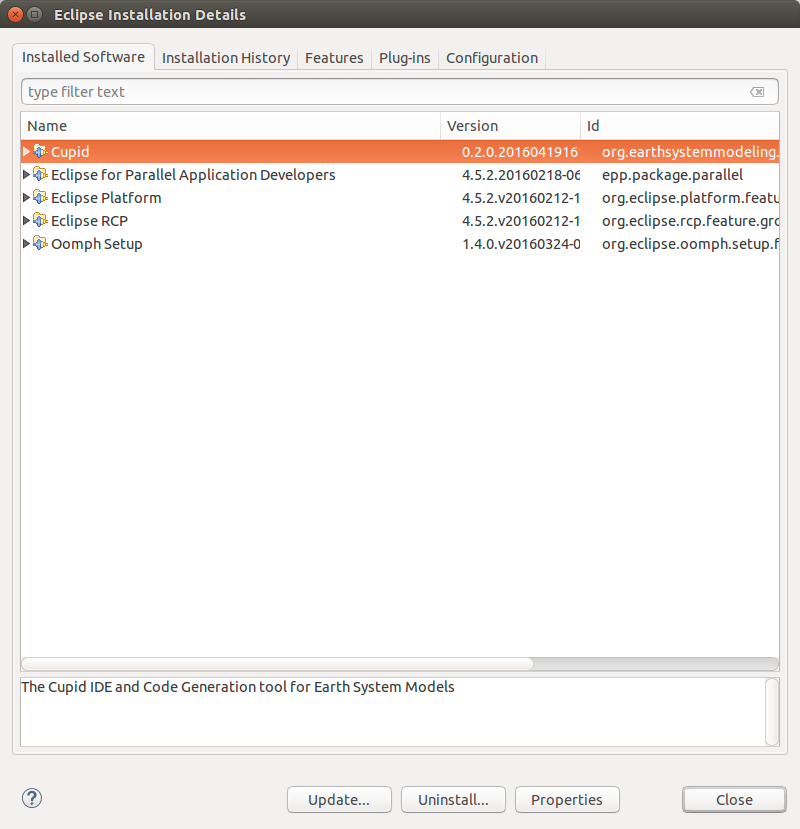
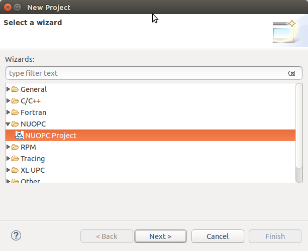
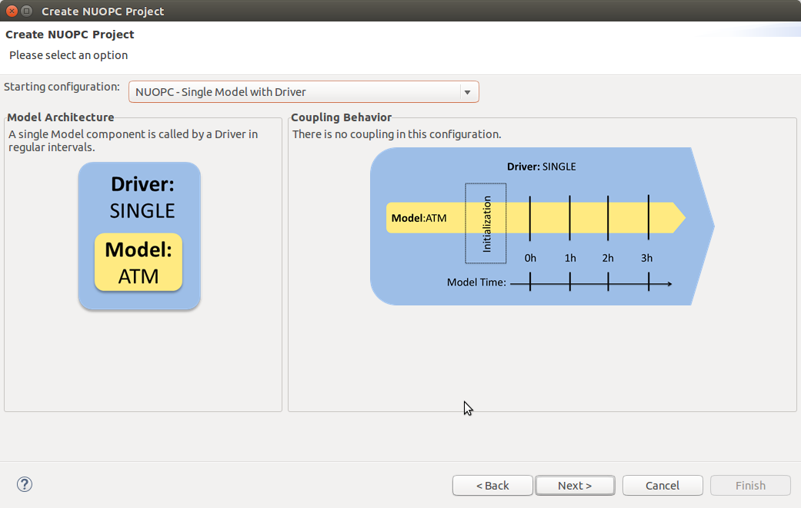
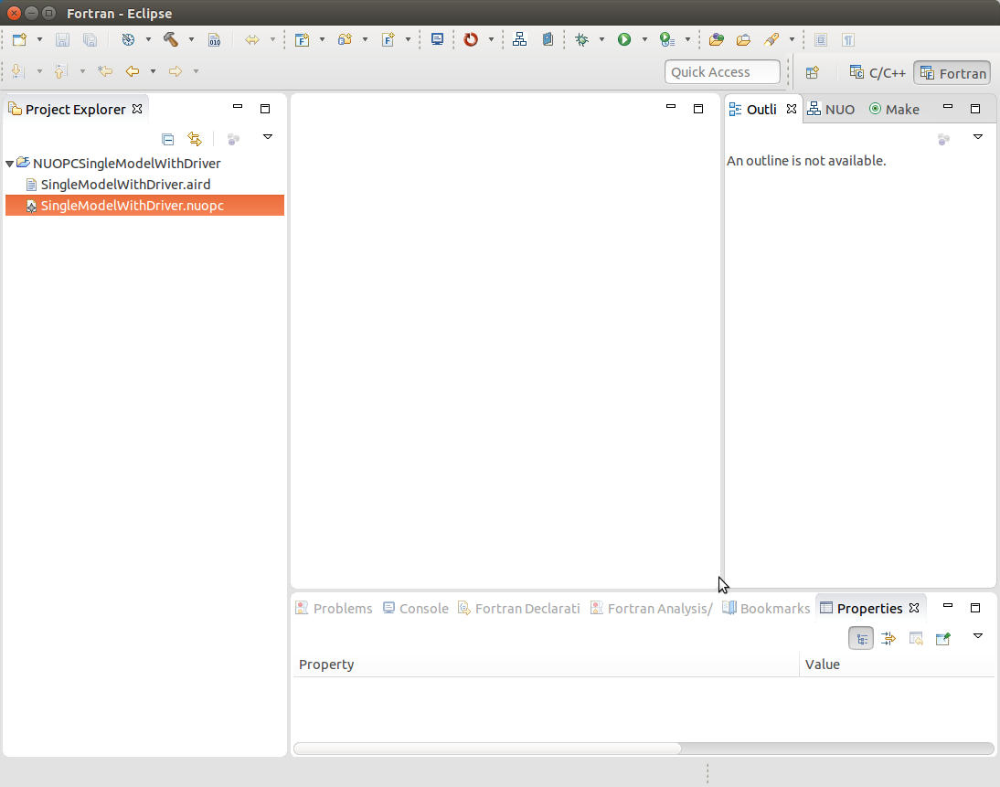
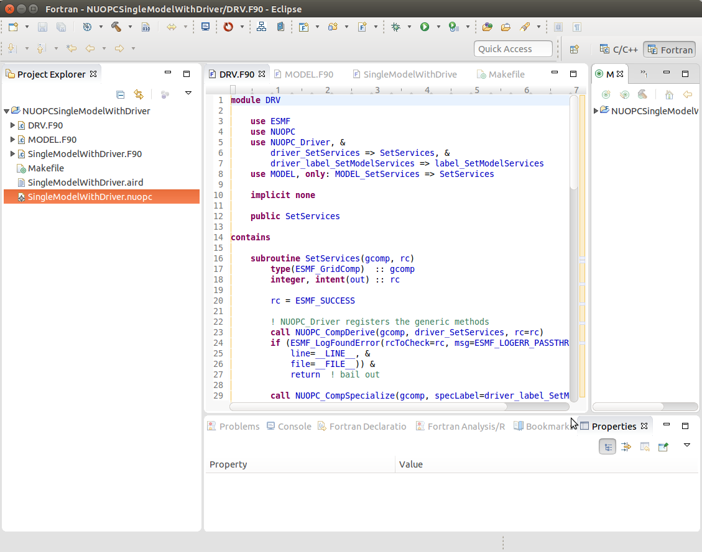
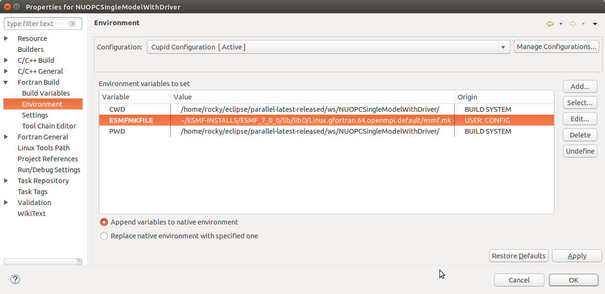
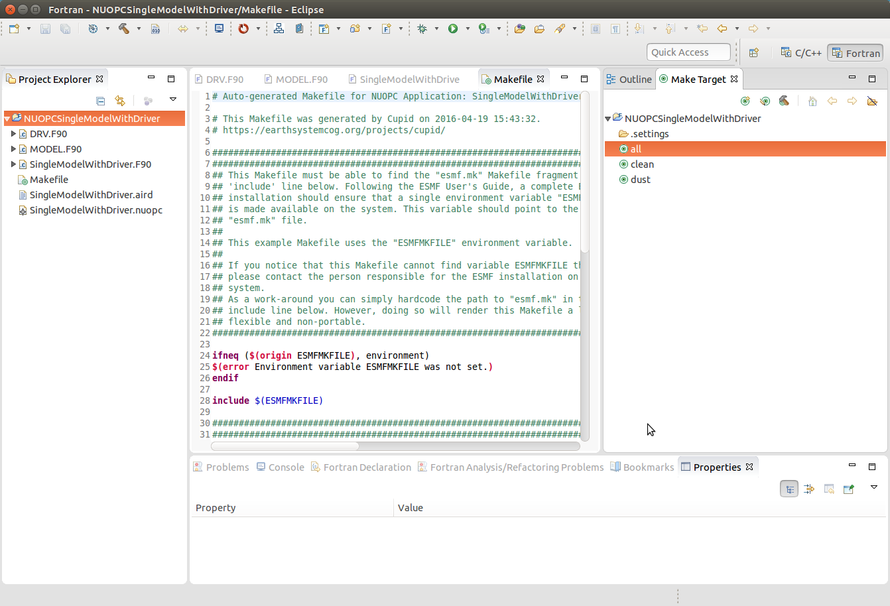
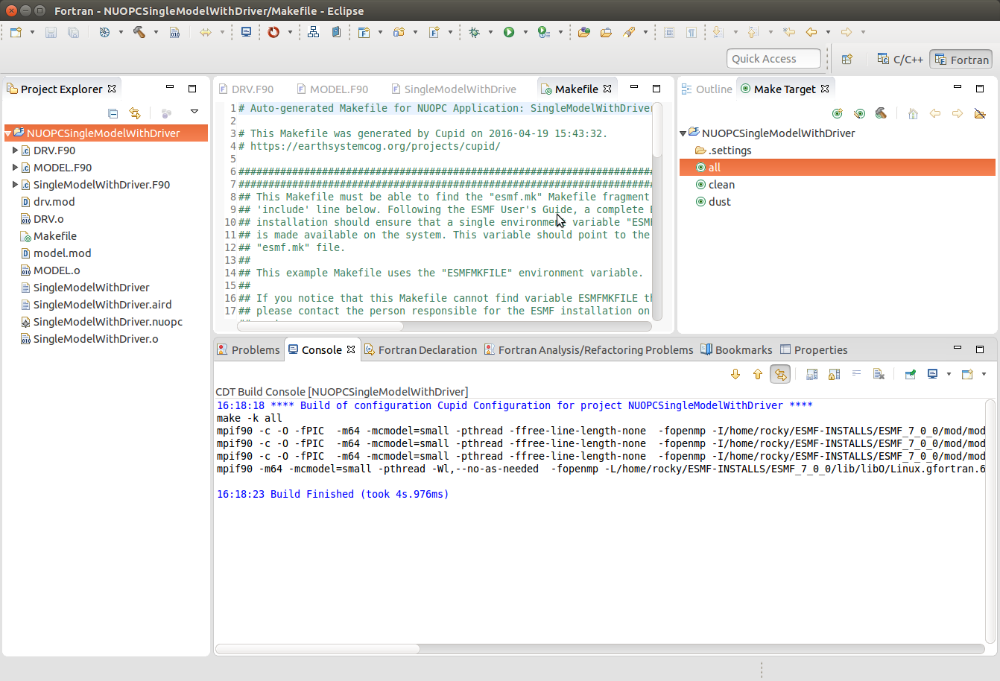
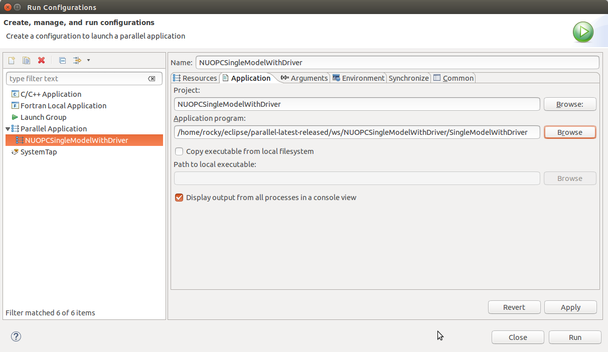
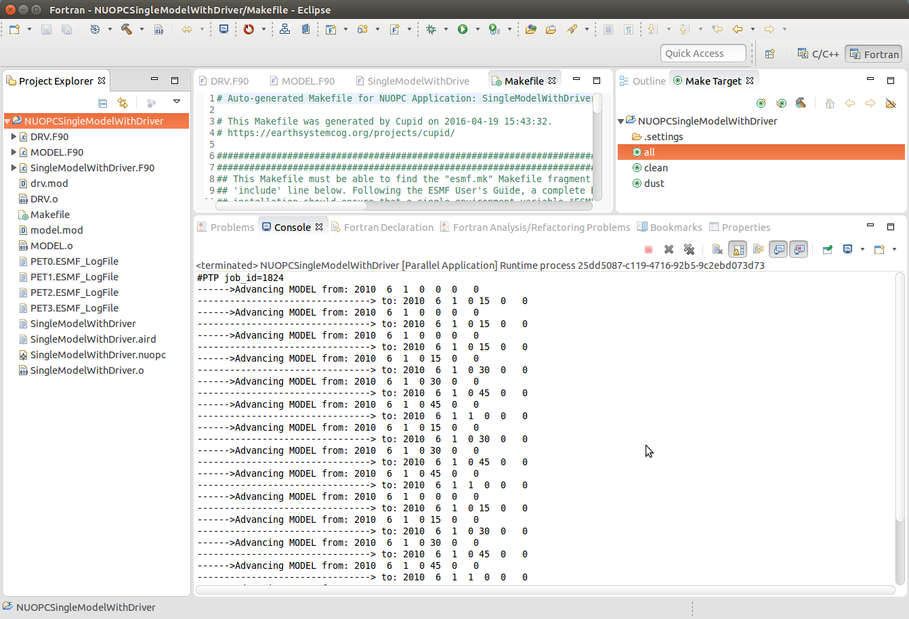

How To
======

Verify that Cupid is Installed
------------------------------

To verify that Cupid is installed, view the Eclipse Installation Details by selecting
**Help -> Installation Details** from the Eclipse menu.  You should see Cupid in the list
of installed software.

Import NUOPC Code
-----------------

Reverse Engineer a NUOPC Cap
----------------------------

Generate NUOPC-compliant Code
-----------------------------

Generate Skeleton Code for a Complete NUOPC Coupled Application
---------------------------------------------------------------

A good way to learn about how NUOPC coupling infrastructure works
is to build a skeleton application containing all of the "plumbing"
but with no real science code to keep it small.

Create a new NUOPC project using the NUOPC Project wizard.  Select
**File -> New -> Project...** from the menu.  Select the NUOPC Project
option under the NUOPC folder and click Next.

On the next screen, select a starting configuration for the skeleton
NUOPC application.  Ideally, you should find a configuration that 
looks something like the actual coupled application you are building.  
But, the selected configuration is a starting point -- you will be able to 
modify the architecture, e.g., by adding new components or rearranging
the connections between components.

On the final screen of the wizard, type in a project name and click
Finish.  The new project will be created.  Initially, the project will
contain a .nuopc file and a .aird file.  The .nuopc file is a configuration
file describing the coupled system.  The .aird file is a representation
file that shows a graphical representation of the coupled system.  

However, before exploring or modifying these files, let's generate all the NUOPC 
code for the system as it stands. Right click on the .nuopc file and select 
**NUOPC -> Generate NUOPC code** from the context menu.  The code for the NUOPC
skeleton application will be generated based on the contents of the .nuopc file.
This includes:

  * A NUOPC "cap" for each Model and Mediator component
  * A NUOPC Driver
  * A top-level main program
  * A makefile

The generated code can now be built using make and the generated Makefile.
To build on the same system that Eclipse is running (this is the easiest
way), first `ensure that ESMF v7 is installed <http://www.earthsystemmodeling.org/esmf_releases/non_public/ESMF_7_0_0/ESMF_usrdoc/node9.html>`_.

The environment variable ESMFMKFILE needs to be set to the location of the
esmf.mk file in the ESMF installation directory.  It is in the same
directory with the ESMF library file(s).  (More info on the esmf.mk file is
available in the `ESMF User Guide <http://www.earthsystemmodeling.org/esmf_releases/non_public/ESMF_7_0_0/ESMF_usrdoc/node7.html>`_.)

To set the ESMFMKFILE environment variable in Eclipse, right click on the 
project folder in the Project Explorer and select **Properties** from the context
menu.  Select **Fortran Build -> Environment** in the list on the left and add
a new environment variable.  Set the name to ESMFMKFILE and the value to the
location of the esmf.mk file on your system.  Click OK when done.

To build from within Eclipse, find the Make Target view on the right side and
double click the "all" target.  If the Make Target view is not shown, you can
bring it up by selecting **Window -> Show View -> Make Target** from the menu.

    
The output from the build will be shown in the Console view at the bottom. The
last file built will be the executable and it is typically named the same as the
project itself.
    

To execute the application on the same system on which Eclipse is running (again,
this is the easiest way), set up a Parallel Application run configuration by 
selecting **Run -> Run Configurations...** from the menu.  The configuration
will be dependent on the MPI distribution on your local machine, but you should
use the same MPI distribution that was used to compile ESMF.  On the Application
tab, you need to select the location of the executable that was generated.  
    

After configuring the parallel run, click Run and you will see output from the
run in Console.  ESMF log files will also be generated, one per process.  These
are named PETX.ESMF_LogFile.  If you do not see the log files immediately after
the run, right click on the project folder and select **Refresh** from the
context menu.
    

    