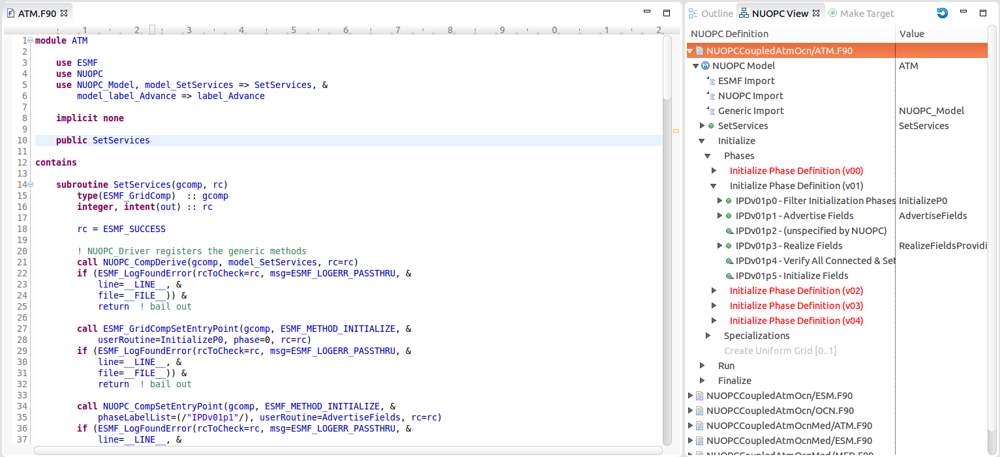
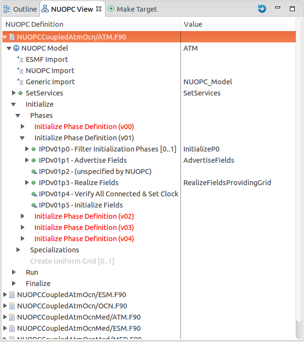

How To
======

Verify that Cupid is Installed
------------------------------

To verify that Cupid is installed, view the Eclipse Installation Details by selecting
**Help -> Installation Details** from the Eclipse menu.  You should see Cupid in the list
of installed software.

.. image:: images/install_details.png
    :scale: 70%

Create a Fortran Project with Your Model Code
---------------------------------------------

There are two options for creating a Fortran project in Eclipse based on whether
the source code you are importing is local or on a remote machine.  The simplest
approach is to have the source code available locally.  However, that is not always
practical so Eclipse provides a synchronization capability with files on a remote
system accessible via SSH.  The sections below describe briefly how to create
these two kinds of projects.

.. seealso::

   This user guide provides only high level guidance in setting up local and
   remote Fortran projects.  More details can be found on the `Parallel Tools
   Platform documentation site <http://www.eclipse.org/ptp/doc.php>`_.

Projects with Local Files
^^^^^^^^^^^^^^^^^^^^^^^^^

To create a new Fortran project with local files, right-click (CTRL-click on Mac)
on the Project Explorer and select **New -> Fortran Project**.  On the New Project
screen you can un-check *Use default location* and browse to the location of
the files.  If you use the default location, the project folder will be in the
Eclipse workspace folder and you will need to import files manually by selecting
**File -> Import...** from the menu after creating the project.  

Under *Project type*, it is recommended that you select Empty Project under the
Makefile project folder.  (The project will not actually be empty if you selected the
location of your local files.)  Click Finish and the new project will be created
and will appear in the Project Explorer.

   
   The New Fortran Project wizard.

Synchronized Projects with Remote Files
^^^^^^^^^^^^^^^^^^^^^^^^^^^^^^^^^^^^^^^

A synchronized Fortran project will copy files from a remote file system and
ensure that the remote and local copies stay synchronized.  This is convenient
if the code will be built and executed on a remote system.  The disadvantage
of this approach is that the initial synchronization can take multiple minutes
if the size of the source tree is large.  However, once the initial synchronization
is complete, only changed files need be communicated over the network.

The first step is set up the connection with the remote machine.  Open the
Connections view by selecting **Window -> Show View -> Other**. In the list
of views, filter for "Connections" and click OK to show the view.

   The Connections view.

Create a new connection by clicking the New Connection button (with a small yellow +) 
in the toolbar on the Connections view.   Choose SSH connection on the following
screen and click next.  On the next screen fill in the details about the connection.
The password can be left blank and you will be prompted at each login.  In some
cases you may need to create multiple connections and use one as the proxy for
another, for example, if you must first authenticate through a login node. Click
Finish when you are done and you will see the new connection in Connetions view.

   The New Connection wizard.

Now create a new synchronized Fortran project right-click in the Project Explorer
and select **New -> Synchronized Fortran Project**.  Fill in the project name, select
the remote connection you created and fill in the file path to the root of the
source code on the remote system.

You can optionally filter which files are synchronized by clicking **Modify file
filtering...** and choosing certain directories to exclude.  In particular, directories
containing large data files and other non-source code should be excluded to speed
up the synchronization.

Under *Project Type* select Empty Project under Makefile project.  Selecting
local and remote toolchains is not required unless you plan to use the Eclipse
build system.  Click Finish and the new project will appear in the Project
Explorer.

   The New Synchronized Fortran Project wizard.

The project will initially be empty and you will need to manually kick off the
first synchronization.  Do this by clicking the synchronize button in the toolbar
or by right-clicking (CTRL-click on mac) the project folder and selecting
**Synchronize -> Sync Active Now**.  Remote files will be copied to the local
workspace.  By default, future synchronizations will happen automatically when changes
are made to local files.  If the remote files change, or if you notice that
changes have not been propagated to the remote system, force a sync using the
procedure above.

   After selecting a project, click the Synchronize button on the toolbar 
   (circled in blue) to kick off the first synchronization.  Remote files
   will be copied to the local workspace.

   After the synchronization process, files will be visible in the
   Project Explorer.
   
   

Ensure Fortran Analysis is Enabled
^^^^^^^^^^^^^^^^^^^^^^^^^^^^^^^^^^
.. important:: 

   **Turning on the Fortran analysis/refactoring engine is required for 	
   Cupid to work properly.**

Cupid depends on the Fortran analysis engine being activated for
projects containing NUOPC code.  By default it is turned off.  To turn
it on for a project, right-click (CTRL-click on Mac) on the project folder and
select **Properties**.  Under **Fortran General -> Analysis/Refactoring**
check the first box, *Enable Fortran analysis/refactoring*. 

   Enable Fortran analysis/refactoring on in the project properties.
   

.. _reverse-engineer:

Reverse Engineer a NUOPC Cap
----------------------------

Cupid's reverse engineering function is capable of analyzing the source 
code of a NUOPC component to create a representation at a higher level
of abstraction.  The reverse engineering analysis is limited to only the 
NUOPC cap of a component, which is typically a single Fortran module.
The analysis does not descend into the model code itself.
Once the higher level representation is obtained, Cupid
is able to provide NUOPC-aware capabilities, such as basic validation
of correct API usage and in-place code generation--i.e., weaving new code
into the correct places of an existing source file.

The reverse engineering analysis phase happens automatically as a background
process when a file is opened that contains code for a NUOPC component.  A basic
check is done to determine if the file is likely to be a NUOPC component. The
check is to see that if the file contains Fortran code and if so that it
imports (uses) one of the generic NUOPC modules (``NUOPC_Model``, 
``NUOPC_Mediator``, or ``NUOPC_Driver``). 

Show the NUOPC View
^^^^^^^^^^^^^^^^^^^

The results of the reverse engineered code can be seen in outline form 
in the NUOPC View.  

 
   The NUOPC View (to the right of the source code) shows an outline
   of a reverse engineered NUOPC component.

The NUOPC View is set up to show whenever the Fortran perspective is selected.
The current perspective is shown in the upper right-hand corner of Eclipse.
There is also an Open Perspective button which can be used to select the
Fortran perspective if it is not already shown.

   
   The NUOPC View is set to appear automatically from the Fortran perspective
   (circled in blue).  Click the Open Perspective button (circled in green)
   to open a new perspective.
   
There are other ways to show the NUOPC View:

  * If the NUOPC View is not visible and you open a file with NUOPC
    code, a dialog will ask you if you would like to open the
    NUOPC View.  This behavior can be turned off in the Cupid
    preferences (select **Window -> Preferences** from the menu and
    select Cupid in the list on the left).
    
  * The main toolbar contains a Show NUOPC View button, circled in
    green below
  
    .. image:: images/nuopc_toolbar.png
  
  * The NUOPC View can be accessed from the 
    **Window -> Show View -> Other** menu
        
The NUOPC View will automatically synchronize with the editor that
has the focus.  It will also refresh whenever you save the file
active in the editor.  (The file will be re-analyzed in the background.)  
If a file does not contain a NUOPC component, the NUOPC View will be blank.

Elements in the NUOPC View outline
^^^^^^^^^^^^^^^^^^^^^^^^^^^^^^^^^^

The outline shown in the NUOPC View in a tree where each element
represents something in the source code, such as a SetServices subroutine,
a NUOPC initialization subroutine, a specialization point subroutine,
imports of NUOPC generic modules, or calls into the NUOPC API. Many
of the elements have small icons: a blue circle with an M maps to a
Fortran module, a green circle maps to subroutine, and a yellow arrow 
pointing to the right represents a subroutine or function call. If
a green circle has a small upward triangle in the corner, it indicates
that the subroutine is not in the current module, but is inherited
from a NUOPC generic component.  Grayed out items do not map to any
source code element, but represent subroutines or API calls that
can be generated.  Red items indicate that there is a validation
problem rooted at that element.  Some elements indicate a cardinality
such as [1..n], which indicates that one or more elements of that type
can exist, or [0..1], which indicates the element is optional.  

The outline is divided into several major sections:

  * module imports (only specific ones are shown)
  * SetServices
  * initialization phases and specialization points
  * run phases and specialization points
  * finalize phases and specialization points

   
   The NUOPC View showing an outline of a NUOPC Model cap.

The NUOPC View is linked to the source code in the active editor.
To navigate to the source code related to the element, double-click
the element.  The relevant code segment will be brought into
focus.  If the element maps to a subroutine definition, the name of 
the subroutine will be highlighted.  If the element maps to an API
call, the call will be highlighted.  If an element represents an
inherited subroutine (a green circle with small triangle), then
it does not appear in the current file, so no code will be highlighted
when double-clicking the element.

   
   Double-clicking on an element in the NUOPC View outline brings
   the relevant code segment into focus in the editor.
   
   
Validation Errors in the NUOPC View
^^^^^^^^^^^^^^^^^^^^^^^^^^^^^^^^^^^

Elements in red in the NUOPC View indicate a validation error.
Currently, the validations performed are to check for
missing subroutines and API calls required by NUOPC, e.g., a missing initialization
phase or a missing specialization point.  The `NUOPC Reference Manual`_
details, for each type of component, which subroutines are required
and which are optional.  Red elements do not indicate a Fortran
compilation issue, but indicate that NUOPC expects the
element to be present and a runtime error will occur without it.
The figure below indicates that the *Advance* specialization point
could not be found during the reverse engineering procedure. Within
NUOPC, *specialization points* are user-provided subroutines that are
called by NUOPC.  Notice also that parent elements are red 
all the way to the root of the tree.  Therefore, if the root of the
tree is red, it indicates a validation issue somewhere below.

To address the issue of the missing Advance element, a new subroutine
needs to be added to the code and that subroutine registered in the
``SetServices`` subroutine.  When this is done, the reverse
engineering engine will pick up this code and the red elements
will disappear.  The section :ref:`generate-code` explains how
to use Cupid to generate skeleton code for missing elements.

   
   The Advance element is red because it could not be found by
   the reverse engineering engine.

.. note:: 

   Cupid's reverse engineering and validation engineer are based on
   static source code analysis.  The engine depends on an internal program database
   (Virtual Program Graph or VPG) provided by the Photran plugin for Eclipse. 
   If a source file does not contain correct Fortran code, the internal
   parser will fail and the reverse engineering analysis will not
   be executed at all, resulting in a blank NUOPC View outline.
   
   There are limitations to static analysis giving rise to false negatives--i.e.,
   reporting a validation issue when in fact the NUOPC component will behave
   correctly.  For example, in some cases the reverse engineering engine 
   expects NUOPC API calls to appear
   within a given subroutine, say SetServices.  In reality, the required API
   call may appear in a different subroutine called by SetServices or even
   several levels down in the call tree. Cupid does not currently perform a 
   full control flow analysis to find NUOPC calls because it is an expensive
   operation.  And, even control flow analysis is limited due to conditional
   logic in the code that depends on the state of the program at runtime.
   
   Cupid, therefore, is fundamentally limited by the realities of
   static analysis.  However, most NUOPC caps have a very similar structure
   with a fair amount of boilerplate code, so we expect that most codes
   will be correctly reverse engineered.   
   
  

.. _generate-code:

Generate NUOPC-compliant Code
-----------------------------

Cupid's code generation facilities make it easier to write the code for
a NUOPC cap.  A *NUOPC cap* acts as a kind of translation layer between your
model code and the coupling infrastructure.  A NUOPC cap is implemented as 
a Fortran module containing a set of subroutines.  Cupid is capable of generating
NUOPC Model caps, NUOPC Drivers, and NUOPC Mediators.  The code generator
can create new Fortran modules for each of these components in new files, or
the code generator can insert snippits of code into an existing file after
it has been reverse engineered.

There are several options for generating code:

  * If there is an existing NUOPC component cap, it should be reverse
    engineered first as described in :ref:`reverse-engineer`.  Then, using
    context menus in the NUOPC View, new code can be generated and inserted
    in-place.  This is the right procedure to use, for example, if you
    need to add an additional specialization point subroutine to an existing
    cap.
    
  * If there is no existing NUOPC code, a template can be generated for
    NUOPC Model caps, NUOPC Drivers, and NUOPC Mediators.  This is the best
    option if you have an existing model and need to create a cap so that
    it can be used in NUOPC-based coupled systems.
    
  * An entire skeleton NUOPC coupled application can be
    generated, including a main program and Makefile.  This is covered in the
    :ref:`generate-complete-skeleton` section.
    
The sections below describe the first two generation options above.

.. seealso::
   
   This user guide is not a comprehensive guide to what comprises a NUOPC
   cap.  For a gentle introduction to NUOPC and what is required in a 
   NUOPC cap, please see the `Building a NUOPC Model`_ document.

Generate Code In-Place in an Existing NUOPC component
^^^^^^^^^^^^^^^^^^^^^^^^^^^^^^^^^^^^^^^^^^^^^^^^^^^^^

If you need to modify code in an existing NUOPC component (Model cap, Driver, or 
Mediator), you should first open up the file so that the reverse engineered
outline is shown in the NUOPC View.  In the following scenario, let's assume
you have an existing NUOPC Model cap for a atmospheric model, but it is 
missing the required Advance specialization point.  This is the subroutine
that should call into your model's run phase to take a time step. In the
NUOPC View, right-click (CTRL-click on Mac) on the *parent* element of the
element you would like to generate.  The context menu will show you all code
generation options currently available.

   
   Right-clicking on an element shows a context menu with the available
   options for code generation.
   
In the context menu, select the element to generate, in this case 
**Generate Advance**.  The requested element will be added to the
outline and the corresponding code generated in the editor.  Often, the
addition of one element results in inserting several code fragments.
In the case of the Advance element, a new subroutine is added, a new
import is added to the ``NUOPC_Model`` use statement, and a call to
``NUOPC_CompSpecialize`` is added in the ``SetServices`` subroutine.
After the code generator runs, yellow markers are added to the vertical bar
to the right of the code editor to indicate where new code was added.
Clicking on one of the markers highlights the generated code.

   
   Yellow markers in the vertical bar next to the code editor indicate
   which code was generated during the *last* code generation action.
   
The generated code will compile as is, although it almost always 
requires additional customization to complete the implementation.
In the case of the Advance subroutine just generated, additional code
is needed to call into the underlying model's time step routine.
This clearly cannot be generated automatically because it is model-dependent.
Therefore a typical workflow will start with a code generation action
as just described, followed by filling in any model-specific implementation.
This will continue until all required initialization phases are complete
and all specialization points have been implemented. 

Generate a NUOPC Model cap, NUOPC Driver, or NUOPC Mediator from Scratch
^^^^^^^^^^^^^^^^^^^^^^^^^^^^^^^^^^^^^^^^^^^^^^^^^^^^^^^^^^^^^^^^^^^^^^^^

Templates for NUOPC Model caps, NUOPC Drivers, NUOPC Mediators can
be generated from scratch.  This option is available from the context
menu in the Project Explorer.  Right-click (CTRL-click on Mac) on a folder
in a Fortran project and select **New** from the context menu and you will
see the three options as shown below.

   
   The Project Explorer context menu with options for generating a NUOPC Model
   cap, a NUOPC Driver, or a NUOPC Mediator.

You will be prompted to enter the name of the component.  Click OK and
a new Fortran file named <COMPONENT>.F90 will appear in the folder (where <COMPONENT>
is the name you provided).  The file will also automatically open in the
editor and you will see the outline in the NUOPC View.  At this point the
template can be customized by manually adding code and/or generating code
fragments from the NUOPC View outline as described above.

   
   A NUOPC Model cap template.

To compile the code, you will need to modify your model's existing build
system to include the new .F90 file.  

.. _generate-complete-skeleton:

Generate Skeleton Code for a Complete NUOPC Coupled Application
---------------------------------------------------------------

A good way to learn about how NUOPC coupling infrastructure works
is to build a skeleton application containing all of the "plumbing"
but with no real science code to keep it small.

Create a new NUOPC project using the NUOPC Project wizard.  Select
**File -> New -> Project...** from the menu.  Select the NUOPC Project
option under the NUOPC folder and click Next.

On the next screen, select a starting configuration for the skeleton
NUOPC application.  Ideally, you should find a configuration that 
looks something like the actual coupled application you are building.  

On the final screen of the wizard, type in a project name and click
Finish.  The new project will be created.  Initially, the project will
contain a .nuopc file which  is a configuration file describing the coupled system.  

.. image:: images/new_project_explorer.png
    :scale: 70%

To generate all the NUOPC code for the system, right-click (CTRL-click on Mac)
on the .nuopc file and select **NUOPC -> Generate NUOPC code** from the context menu.  
The code for the NUOPC skeleton application will be generated.
This includes:

  * A NUOPC cap for each Model component
  * A NUOPC Mediator, if present in the configuration
  * A NUOPC Driver
  * A top-level main program
  * A makefile

Build the Skeleton Application Locally
^^^^^^^^^^^^^^^^^^^^^^^^^^^^^^^^^^^^^^

The generated code can now be built using make and the generated Makefile.
To build on the same system that Eclipse is running (this is the easiest
way), first `ensure that ESMF v7 is installed <http://www.earthsystemmodeling.org/esmf_releases/non_public/ESMF_7_0_0/ESMF_usrdoc/node9.html>`_.

The environment variable ESMFMKFILE needs to be set to the location of the
esmf.mk file in the ESMF installation directory.  It is in the same
directory with the ESMF library file(s).  (More info on the esmf.mk file is
available in the `ESMF User Guide <http://www.earthsystemmodeling.org/esmf_releases/non_public/ESMF_7_0_0/ESMF_usrdoc/node7.html>`_.)

To set the ESMFMKFILE environment variable in Eclipse, right click on the 
project folder in the Project Explorer and select **Properties** from the context
menu.  Select **Fortran Build -> Environment** in the list on the left and add
a new environment variable.  Set the name to ESMFMKFILE and the value to the
location of the esmf.mk file on your system.  Click OK when done.

To build from within Eclipse, find the Make Target view on the right side and
double click the "all" target.  If the Make Target view is not shown, you can
bring it up by selecting **Window -> Show View -> Make Target** from the menu.

.. image:: images/make_target_view.png
    :scale: 70%
    
The output from the build will be shown in the Console view at the bottom. The
last file built will be the executable and it is typically named the same as the
project itself.
    

Set up a Parallel Application run and  Execute Locally
^^^^^^^^^^^^^^^^^^^^^^^^^^^^^^^^^^^^^^^^^^^^^^^^^^^^^^

To execute the application on the same system on which Eclipse is running (again,
this is the easiest way), set up a Parallel Application run configuration by 
selecting **Run -> Run Configurations...** from the menu.  The configuration
will be dependent on the MPI distribution on your local machine, but you should
use the same MPI distribution that was used to compile ESMF.  On the Application
tab, you need to select the location of the executable that was generated.  
    

After configuring the parallel run, click Run and you will see output from the
run in Console.  ESMF log files will also be generated, one per process.  These
are named PETX.ESMF_LogFile.  If you do not see the log files immediately after
the run, right click on the project folder and select **Refresh** from the
context menu.
    
.. image:: images/console_run.png
    :scale: 70%
 

Show the NUOPC Reference Manual
-------------------------------

The NUOPC Reference Manual can be shown directly within Eclipse so that you
do not need to leave the tool to read API documentation.  To open the NUOPC
documentation viewer, either click on the Show NUOPC Doc View button in the
toolbar or from the menu select **Window -> Show View -> Other** and select
the *NUOPC Doc* view in the list.

The documentation viewer will automatically synchronize with the current outline
in the NUOPC View.  For example, if the current component in the NUOPC View
outline is a NUOPC Mediator component, the documentation viewer will bring that
part of the Reference Manual into focus.

   Click the blue book in the toolbar to show the NUOPC Reference Manual.

   The NUOPC Reference Manual is opened in a small browser built into Eclipse.

.. _NUOPC Reference Manual: http://www.earthsystemmodeling.org/esmf_releases/non_public/ESMF_7_0_0/NUOPC_refdoc/

.. _Building a NUOPC Model: http://www.earthsystemmodeling.org/esmf_releases/non_public/ESMF_7_0_0/NUOPC_howtodoc/    