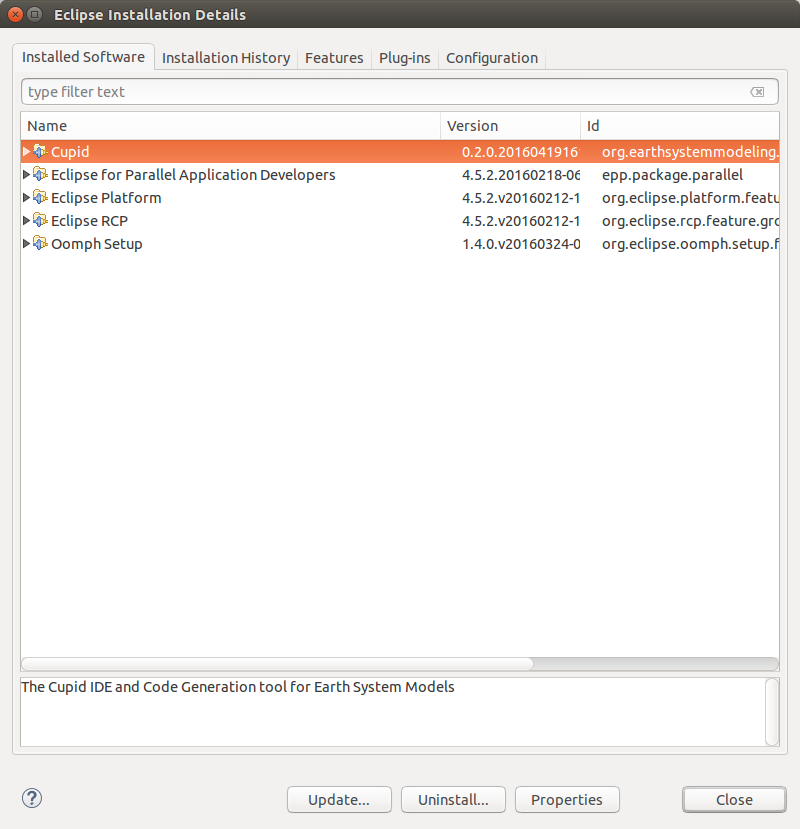

Installation
============

Information about installing Cupid is maintained on the Cupid website:
https://www.earthsystemcog.org/projects/cupid/

.. note::

   * Prerequisites: https://www.earthsystemcog.org/projects/cupid/installation/prerequisites
   * Installation from the Eclipse marketplace: https://www.earthsystemcog.org/projects/cupid/installation/marketplace
   * Installation with the Eclipse installer: https://www.earthsystemcog.org/projects/cupid/installation/eclipseinstaller

Verify that Cupid is Installed
------------------------------

To verify that Cupid is installed, view the Eclipse Installation Details by selecting
**Help -> Installation Details** from the Eclipse menu.  You should see Cupid in the list
of installed software.

