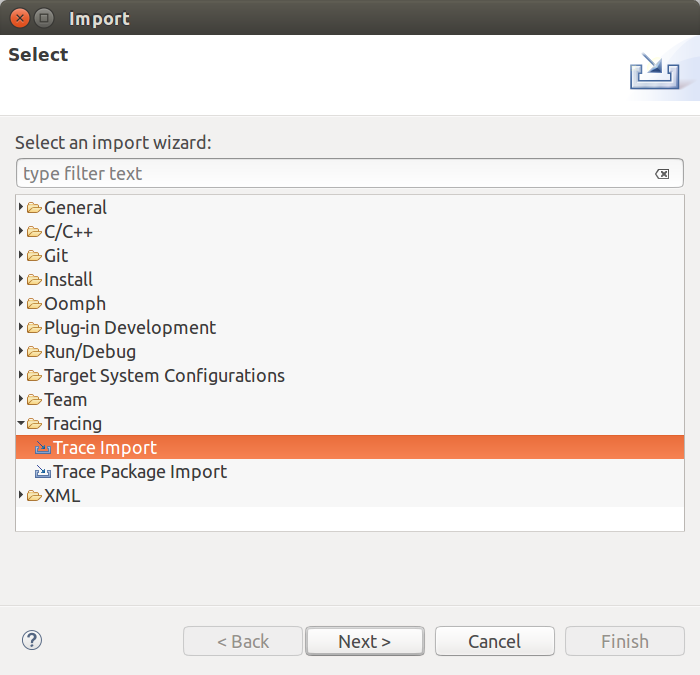
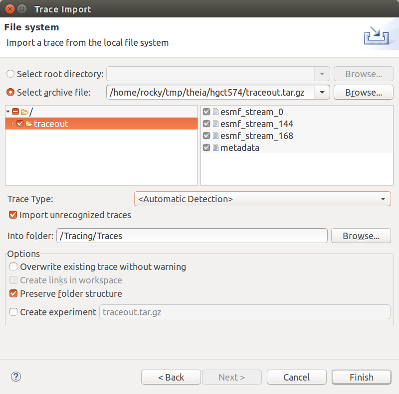
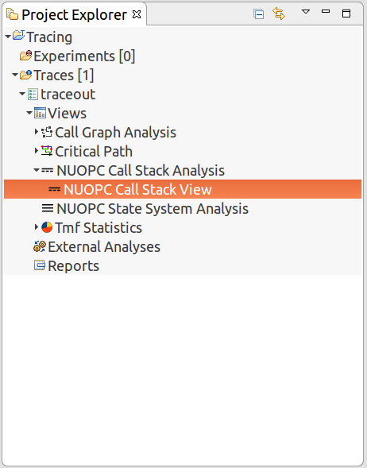
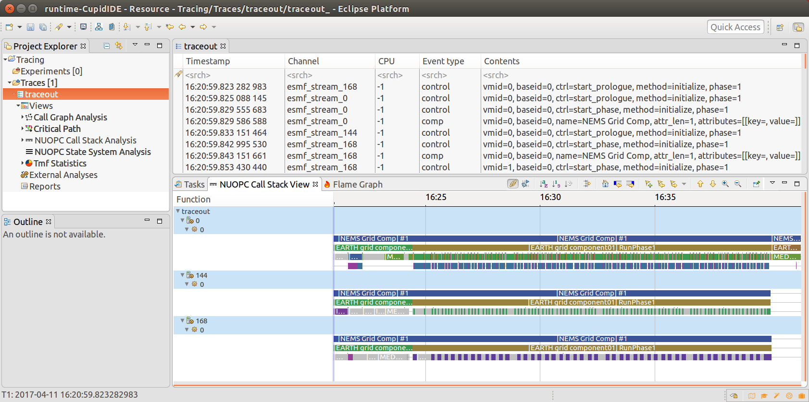

Runtime Analysis of NUOPC Applications
======================================

This section describes Cupid's features for analyzing a NUOPC application
run.  The runtime analysis requires two steps:

  - First, execute a NUOPC application with tracing turned on
  - Second, import the trace into Cupid to analyze it.

The current supported analysis shows a multi-process (PET) view of the entry
and exit points from NUOPC run phases.  This allows for a component-level
performance analysis and is useful for load balancing a coupled system.

 
Perform a Run of a NUOPC Application with Tracing Enabled
---------------------------------------------------------

First, make sure you compile your application with **ESMF version 7.1 beta snapshot** or later.

In order for the analysis entries to be put into the ESMF log files, you
must set the following environment variable before the run:

.. code-block:: bash
		
	$ export ESMF_RUNTIME_TRACE=ON

Optionally, you may set the environment variable `ESMF_RUNTIME_TRACE_PETLIST`
to limit which PETs are traced.  This is recommended to limit the size of 
the output trace. If you do not set this environment variable, all PETs will 
be traced by default. Each PET should be separated by a space, and you can 
use the notation "X-Y" to indicate a range of PETs.  **A good approach is to
trace only the root PET of each component in the NUOPC application.** Note that
PET zero will always be traced, regardless of the `ESMF_RUNTIME_TRACE_PETLIST`
setting.

.. code-block:: bash

	# turn on tracing for PETs 0, 32, and 64 through 72		
	$ export ESMF_RUNTIME_TRACE_PETLIST="0 32 64-72"

After setting these environment variables execute the NUOPC application in 
the way you normally do. The trace itself will be placed into the `traceout`
directory. The directory will contain a `metadata` file and one file per
PET that was traced.  For example, if PETs 0, 144, and 168 having tracing
enabled, the `traceout` directory looks like this:

.. code-block:: bash

	[Rocky.Dunlap@tfe04 traceout]$ ls -la
	total 2320
	drwx--S--- 2 Rocky.Dunlap stmp    4096 Apr 11 22:20 .
	drwxr-sr-x 5 Rocky.Dunlap stmp   73728 Apr 11 23:20 ..
	-rw-r----- 1 Rocky.Dunlap stmp 1048576 Apr 11 22:41 esmf_stream_0
	-rw-r----- 1 Rocky.Dunlap stmp  229376 Apr 11 22:41 esmf_stream_144
	-rw-r----- 1 Rocky.Dunlap stmp  163840 Apr 11 22:41 esmf_stream_168
	-rw-r----- 1 Rocky.Dunlap stmp    3370 Apr 11 22:41 metadata

The trace files are in a binary format called 
`Common Trace Format <http://diamon.org/ctf/>`_ so they cannot be viewed
directly. If the run was performed on a remote machine, the trace directory needs to be 
transferred to your local machine where Eclipse is installed.  Tar the entire
directory and copy it to your machine.

.. code-block:: bash

	$ tar cfz traceout.tar.gz traceout
	# scp traceout.tar.gz to your local machine where Eclipse is installed

Import the NUOPC Trace into Eclipse
-----------------------------------

In Eclipse, choose "File -> Import..." from the menu and select "Trace Import"
in the folder "Tracing Project."

  
   Import a trace into Eclipse
  
Click Next. On the next screen select the trace to import. You can import a 
trace by either selecting the root directory of the trace or by selecting
an archive file containing the trace directory. After selecting the root
directory or archive, check the trace root folder in the list (see figure below).
Then click Finish.

   :scale 85%
  
   Select trace root directory or trace archive file to import

When complete, you will see a new project in the Project Explorer called
`Tracing` with a folder called `Traces`.  This folder contains the imported
trace. It will have a name that matches the archive file or root directory
you selected. Double-click to open the trace and see the list of trace events.
 

Call Stack View for Performance Analysis 
----------------------------------------

The NUOPC Call Stack view shows visually the entry and exit points of
each NUOPC/ESMF phase in the traced PETs. The PETs are aligned in time 
vertically so that it is easy to see concurrency in the system. In other
words, a vertical slice shows what each PET is doing at the same point
in time during the execution.

Open the NUOPC Call Stack View by double-clicking "NUOPC Call Stack View"
in the Project Explorer under the imported trace. It is under Views / 
NUOPC Call Stack Analysis (see figure below).

   :scale 85%
  
   Double-click "NUOPC Call Stack View" in the Project Explorer
   to open up the view.

   :scale 85%
  
   The NUOPC Call Stack View showing three PETs
  
The NUOPC Call Stack View toolbar allows you to navigate the view.

 - The house icon zooms out to see the full execution trace.
 - The + and - magnifying glass will zoom in and out.
 - Right-click (CTRL-click on Mac), hold, and drag to zoom in on a 
   particular time window.
 - Left-click (CTRL-click on Max), hold, and drag to select a region
   and see the time delta at the bottom of the window.
 
