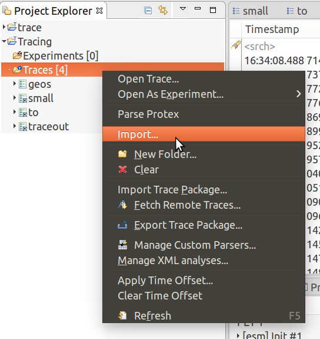
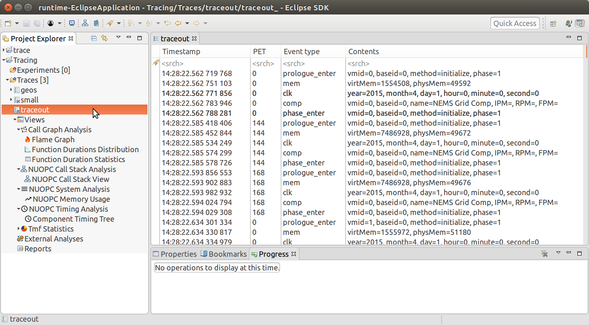
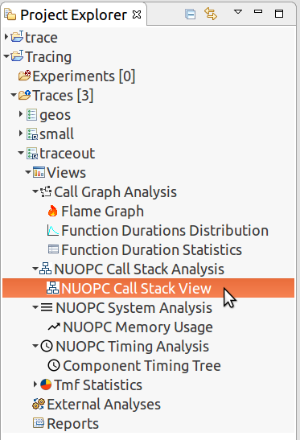
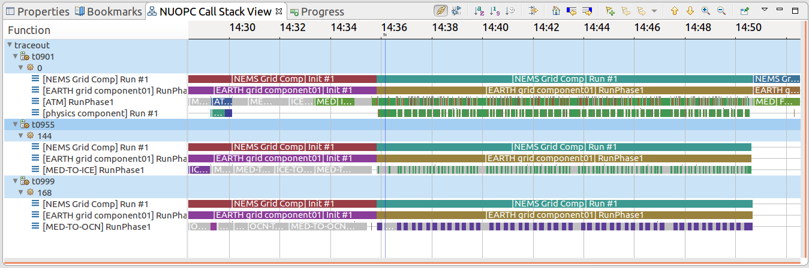
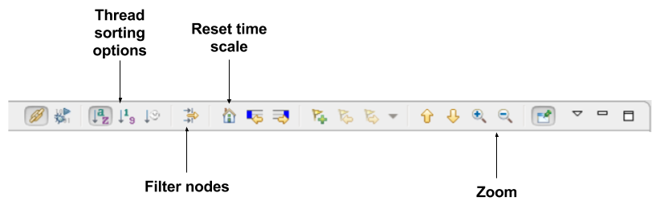
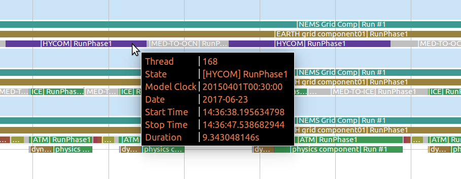
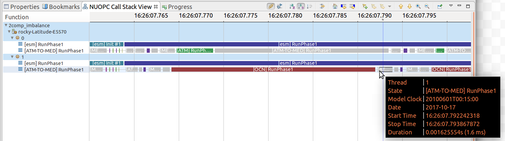
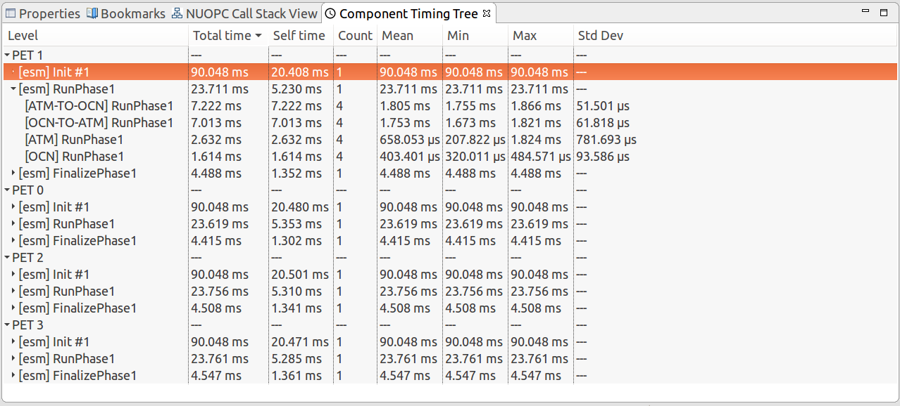
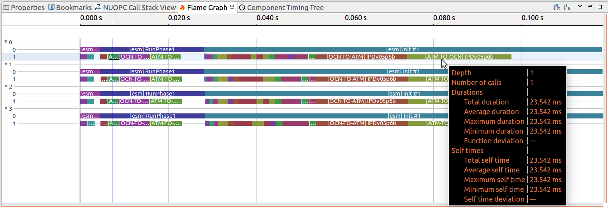
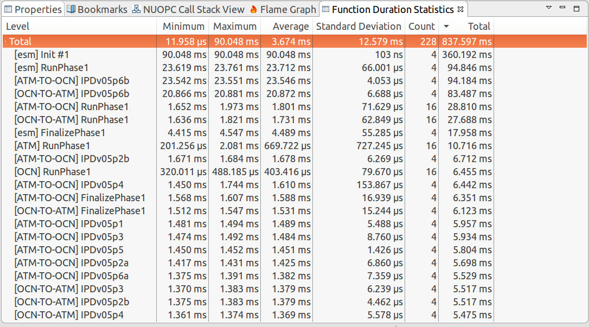

NUOPC Trace Analysis
======================================

.. important:: 
    These features require a new tracing capability available in a development
    snapshot of ESMF.  **You must use at least ESMF 7.1.0 beta snapshot 31.** 
    
    The following command can be used to acquire this development snapshot of
    ESMF:
    
    `git archive --remote=git://git.code.sf.net/p/esmf/esmf --format=tar --prefix=esmf/  ESMF_7_1_0_beta_snapshot_31 | tar xf -`
    
    To check out other snapshots, simply replace the *ESMF_7_1_0_beta_snapshot_31* with
    another tag.
    
    Development snapshots are built in the same way as releases. Development snapshots
    are not formal releases of ESMF and are "use at your own risk."  Efforts are made to ensure
    that most unit and system tests are passing on typical platforms, but there are no
    guarantees of the stability of development snapshots.
        
    For more information about development snapshots of ESMF, please email:
    `esmf_support@list.woc.noaa.gov <mailto:esmf_support@list.woc.noaa.gov>`_.

This section describes how to use Cupid's features for analyzing a NUOPC application
trace.  The analyses show component timings and profiles and is useful for discovering 
expensive execution phases and determining if there is a load imbalance in the coupled 
system. The analyses are custom analyses based on the 
`TraceCompass Eclipse plugin <http://tracecompass.org/>`_. This
plugin will automatically install with Cupid.

The overall process requires two steps:

  - First, execute a NUOPC application with tracing turned on
  - Second, import the trace into Cupid for analysis and visualization

.. _trace-run:

Generate a Trace of a NUOPC Application
---------------------------------------

First, make sure you compile your application with **ESMF version 7.1 beta snapshot 31** or later.

Then, set the following environment variable before the run:

.. code-block:: bash
		
	$ export ESMF_RUNTIME_TRACE=ON

This will automatically instrument the components to collect timing and
other information to put into the trace.

Though not required, it is *highly recommended* to set the environment 
variable `ESMF_RUNTIME_TRACE_PETLIST` to limit which PETs are traced.
This will help to limit the size of 
the output trace and speed up the analysis. If you do not set this environment variable, 
all PETs will 
be traced by default. Each PET should be separated by a space, and you can 
use the notation "X-Y" to indicate a range of PETs.  **A good approach is to
trace only the root PET of each component in the NUOPC application.** Note that
PET zero will always be traced, regardless of the `ESMF_RUNTIME_TRACE_PETLIST`
setting.

.. code-block:: bash

	# turn on tracing for PETs 0, 32, and 64 through 72		
	$ export ESMF_RUNTIME_TRACE_PETLIST="0 32 64-72"

After setting these environment variables execute the NUOPC application in 
the way you normally do. The trace itself will be placed into the `traceout`
directory. The directory will contain a `metadata` file and one file per
PET that was traced.  For example, if PETs 0, 144, and 168 having tracing
enabled, the `traceout` directory looks like this:

.. code-block:: bash

	[Rocky.Dunlap@tfe04 traceout]$ ls -la
	total 2320
	drwx--S--- 2 Rocky.Dunlap stmp    4096 Apr 11 22:20 .
	drwxr-sr-x 5 Rocky.Dunlap stmp   73728 Apr 11 23:20 ..
	-rw-r----- 1 Rocky.Dunlap stmp 1048576 Apr 11 22:41 esmf_stream_0
	-rw-r----- 1 Rocky.Dunlap stmp  229376 Apr 11 22:41 esmf_stream_144
	-rw-r----- 1 Rocky.Dunlap stmp  163840 Apr 11 22:41 esmf_stream_168
	-rw-r----- 1 Rocky.Dunlap stmp    3370 Apr 11 22:41 metadata

The trace files are in a binary format called 
`Common Trace Format <http://diamon.org/ctf/>`_ so they cannot be viewed
directly. If the run was performed on a remote machine, the trace directory needs to be 
transferred to your local machine where Eclipse is installed.  Tar the entire
directory and copy it to your machine.

.. code-block:: bash

	$ tar cfz traceout.tar.gz traceout
	# scp traceout.tar.gz to your local machine where Eclipse is installed

Import and Open the Trace
-------------------------

Import the Trace
^^^^^^^^^^^^^^^^

In Eclipse, choose "File -> Import..." from the menu and select "Trace Import"
in the folder "Tracing Project."

.. figure:: images/trace_import_1.png
   :scale: 85%
  
   Import a trace into Eclipse
  
Click Next. On the next screen select the trace to import. You can import a 
trace by either selecting the root directory of the trace or by selecting
an archive file containing the trace directory. After selecting the root
directory or archive, check the trace root folder in the list (see figure below).
Then click Finish.

.. figure:: images/trace_import_2.png
   :scale: 85%
  
   Select trace root directory or trace archive file to import

When complete, you will see a new project in the Project Explorer called
`Tracing` with a folder called `Traces`.  This folder contains the imported
trace. It will have a name that matches the archive file or root directory
you selected. Double-click to open the trace and see the list of trace events.

If you already have an existing tracing project set in Eclipse, you can add
traces to it by right-clicking on the Traces folder and selecting Import
from the context menu.

  
   Use the context menu to add traces to an existing project
 

Open the Trace 
^^^^^^^^^^^^^^

Double click on the trace in the Project Explorer to open the trace. You will
see a table listing all of the events in the trace. Expand
the "Views" element under the trace in the Project Explorer and you will see
a list of available analyses and associated views. 

  
   The Project Explorer on the left shows all of the available analyses
   for the trace and associated views under each analysis. On the right
   is the raw list of events in the trace.
   
.. important:: 
    If you do not see a set of analyses under the trace in the Project
    Explorer, but instead a list of files, you need to switch to the
    "Tracing" perspective.  From the menu select 
    **Window->Perspective->Open Perspective->Other...**, find the "Tracing"
    perspective and click open.

NUOPC Call Stack Analysis 
-------------------------

The NUOPC Call Stack view shows visually the entry and exit points of
each NUOPC/ESMF phase in the traced PETs. The PETs are aligned in time 
vertically so that it is easy to understand concurrency in the system.
This view is helpful for seeing the hierarchical order of execution 
of component phases and for assessing load imbalance.  The view is
organized first by host/node (i.e., in a supercomputing environment)
and then by PET number. 

Open the NUOPC Call Stack View by double-clicking "NUOPC Call Stack View"
in the Project Explorer under the imported trace. It is under Views / 
NUOPC Call Stack Analysis (see figure below).

  
   Double-click "NUOPC Call Stack View" in the Project Explorer
   to open up the view.

For each PET, the view shows initialize, run, and finalize component 
execution phases and timing information about each phase.

  
   The NUOPC Call Stack View showing three PETs
  
The NUOPC Call Stack View toolbar allows you to navigate the view. If the
trace is large (in terms of number of events or PETs), the call stack
view may take a few seconds or longer to populate. Click the house icon
to zoom out to the full execution trace.

 - The house icon zooms out to see the full execution trace.
 - The + and - magnifying glass will zoom in and out.
 - Right-click (CTRL-click on Mac), hold, and drag to zoom in on a 
   particular time window.
 - Left-click (CTRL-click on Max), hold, and drag to select a region
   and see the time delta at the bottom of the window.

  
   The Call Stack toolbar.

Hover over a call stack element to see detailed timing information
as well as the current model time on the ESMF clock in that phase.

  
   Detailed timing information shown by hovering over a call stack element.

 
 
Check for Load Imbalance
^^^^^^^^^^^^^^^^^^^^^^^^

In a coupled system with components running concurrently, ensuring a
good load balance is important for computational efficiency. In NUOPC-based
systems, concurrent components are assigned disjoint sets of PETs. In
order to check for imbalance using the Call Stack View, make sure you
trace a set of PETs that covers at least one PET of each component. A good
approach is to trace the root (smallest) PET of each component. 
As stated above in the :ref:`trace-run` section, set
the environment variable *ESMF_RUNTIME_TRACE_PETLIST* before executing
the application to control which PETs to trace.

A clue that there is a load imbalance in the system is that too much
time is spent inside NUOPC Connectors. Connectors
are the primary communication components--they are
responsible for moving data between Models and Mediators.  
If a system has a load imbalance, then unnecessary time will be 
spent inside Connectors when one component finishes its computation 
before another and must wait for data to be delivered by the Connector.

In the Call Stack View, Connectors are colored grey. The example trace
shown below demonstrates a load imbalance.  The first process, PET 0
executes the ATM component (shown in green), and the second process, PET 1, executes the
OCN component (shown in red) concurrently.  The ATM component finishes
its RunPhase1 execution and enters the ATM-TO-MED Connector. The OCN component's
RunPhase1 executes concurrently, but requires about four times as much
execution time. When the OCN PET finishes its RunPhase1 it enters the ATM-TO-MED
Connector as well, and both PETs are then able to proceed. The load imbalance
means that PET 0 sits idle for a significant portion of time.

  
   A load imbalance in which the [ATM] RunPhase1 (shown in green)
   finishes before [OCN] RunPhase1 and wait idle inside
   the ATM-TO-MED Connector.

Load imbalance is possible whenever two or more components are running
concurrently.  One way to address this is to re-balance the PET counts
so that more expensive components receive more PETs. The optimal PET
count per component depends on a lot of factors, including the scalability of each
component.

NUOPC Timing Analysis 
---------------------

Component Timing Tree
^^^^^^^^^^^^^^^^^^^^^

The Component Timing Tree shows timing statistics for NUOPC execution
phases as well as user-defined regions in the trace.  The top level elements
in the timing tree are the PET numbers.  (The timers are NOT aggregated
across PETs.) Then, under each PET, the timing statistics
are organized hierarchically to mirror the component tree structure of that PET.
The tree can be sorted in ascending and descending order by each of the
statistics by clicking on the column headings.

  
   The Component Timing Tree view is organized according to
   the component hierarchy.

The statistics in the tree include:

  Total time
      total aggregate time spent in the region, inclusive of all sub-regions
      
  Self time
      total aggregate time spent in the region, excluding all sub-regions
      
  Count
      number of times the region is entered (called)
      
  Mean
      average time per execution of the region, 
      inclusive of all sub-regions
      
  Min
      minimum execution time among calls into the region,     
      inclusive of all sub-regions
      
  Max
      maximum execution time among calls into the region,       
      inclusive of all sub-regions
      
  Std Dev
      standard deviation of execution times among calls into the region,  
      inclusive of all sub-regions  

Keep in mind that regions can appear at multiple places in the hierarchy.
The statistics in the tree are relevant for that particular location
in the hierarchy. For example, the "Total time" spent in a region means
the aggregate time of the all calls to the region *at that place in the
hierarchy*.

Timing User-defined Regions
^^^^^^^^^^^^^^^^^^^^^^^^^^^

Timing user-defined regions is supported by inserting calls to `ESMF_TraceRegionEnter()` 
and `ESMF_TraceRegionExit()` into the application code and generating a trace.  See the 
`tracing section of the ESMF reference manual <http://www.earthsystemmodeling.org/esmf_releases/last_built/ESMF_refdoc/node6.html#sec:Tracing>`_ 
for more information.
   
User-defined regions will appear in the Component Timing Tree at their proper
nesting level.
   

Flame Graph
^^^^^^^^^^^

The Flame Graph shows the same statistics available in the Component Timing
Tree in a visual form. The Flame Graph is an aggregated form of the
Call Stack View, organized by depth and then region at that depth. This allows
you to quickly see where most of the time is spent in the application when
deciding where to optimize.

The Flame Graph is provided by the TraceCompass plugin, and more detailed
information about this view is available in the 
`TraceCompass user guide <http://archive.eclipse.org/tracecompass/doc/stable/org.eclipse.tracecompass.doc.user/LTTng-UST-Analyses.html#Flame_Graph_View>`_.

  
   The Flame Graph view
	
   
Function Duration Statistics
^^^^^^^^^^^^^^^^^^^^^^^^^^^^
The Function Duration Statistics view is a 
flat list of all the regions, including component execution phases and 
user-defined regions.  Unlike the Component Timing Tree, these statistics
are aggregated across all PETs in the trace.

The Function Duration Statistics View is provided by the TraceCompass
plugin, and more detailed information about this view is available in the
`TraceCompass user guide <http://archive.eclipse.org/tracecompass/doc/stable/org.eclipse.tracecompass.doc.user/LTTng-UST-Analyses.html#Function_Duration_Statistics>`_.

  
   The Function Duration Statistics view aggregates each region 
   across all PETs in the trace.
   
   
   