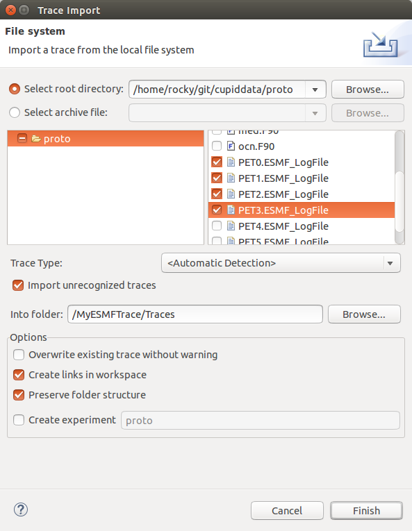
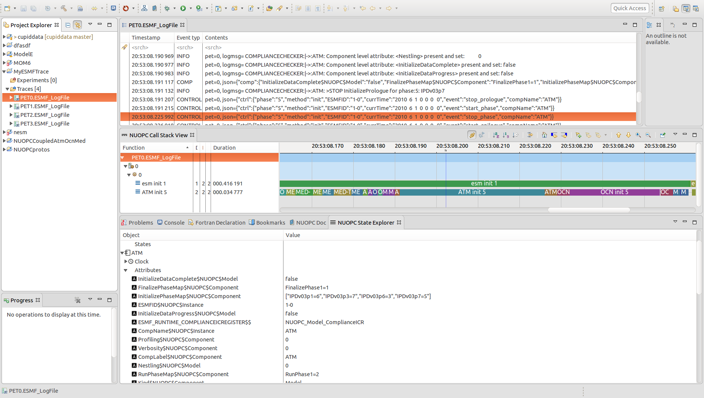

Runtime Analysis of NUOPC Applications
======================================

This section describes Cupid's features for analyzing a NUOPC application
run.  The runtime analysis requires two steps:

  - First, execute a NUOPC application with tracing turned on
  - Second, import the trace into Cupid to analyze it.

The current supported analysis shows a multi-process (PET) view of the entry
and exit points from NUOPC run phases.  This allows for a component-level
performance analysis and is useful for load balancing a coupled system.

 
Perform a Run of a NUOPC Application with Tracing Enabled
---------------------------------------------------------

First, make sure you compile your application with **ESMF version 7.1 beta snapshot** or later.

In order for the analysis entries to be put into the ESMF log files, you
must set the following environment variable before the run:

.. code-block:: bash
		
	$ export ESMF_RUNTIME_TRACE=ON

Optionally, you may set the environment variable `ESMF_RUNTIME_TRACE_PETLIST`
to limit which PETs are traced.  This is recommended to limit the size of 
the output trace. If you do not set this environment variable, all PETs will 
be traced by default. Each PET should be separated by a space, and you can 
use the notation "X-Y" to indicate a range of PETs.  **A good approach is to
trace only the root PET of each component in the NUOPC application.**

.. code-block:: bash

	# turn on tracing for PETs 0, 32, and 64 through 72		
	$ export ESMF_RUNTIME_TRACE_PETLIST="0 32 64-72"

After setting these environment variables execute the NUOPC application in 
the way you normally do. The trace itself will be placed into the `traceout`
directory. The directory will contain a "metadata" file and one file per
PET that was traced.  For example, if PETs 0, 144, and 168 having tracing
enabled, the `traceout` directory looks like this:

.. code-block:: bash

	[Rocky.Dunlap@tfe04 traceout]$ ls -la
	total 2320
	drwx--S--- 2 Rocky.Dunlap stmp    4096 Apr 11 22:20 .
	drwxr-sr-x 5 Rocky.Dunlap stmp   73728 Apr 11 23:20 ..
	-rw-r----- 1 Rocky.Dunlap stmp 1048576 Apr 11 22:41 esmf_stream_0
	-rw-r----- 1 Rocky.Dunlap stmp  229376 Apr 11 22:41 esmf_stream_144
	-rw-r----- 1 Rocky.Dunlap stmp  163840 Apr 11 22:41 esmf_stream_168
	-rw-r----- 1 Rocky.Dunlap stmp    3370 Apr 11 22:41 metadata

If the run was performed on a remote machine, the trace directory needs to be 
transferred to your local machine where Eclipse is installed.  Tar the entire
directory and copy it to your machine.

.. code-block:: bash

	$ tar cfz traceout.tar.gz traceout
	$ scp traceout.tar.gz ...  # command to transfer files

Create Tracing Project and Import ESMF Log Files
------------------------------------------------

In Eclipse, create a new Tracing Project from the menu:  Select File->New->Project...
In the folder "Tracing" choose "Tracing Project" and click Next.  Give the project
a name and then click Finish.

The new tracing project will appear in the Project Explorer to the left, including
an `Experiments` folder and a `Traces` folder.  Right-click (CTRL-click on Mac) on the
`Traces` folder and select Import...  Assuming you have transferred the log files locally,
select the root directory containing the log files and then check off the log files
you wish to import.  Then click Finish.

   
   Import ESMF log files into the trace project.

The imported log files will appear in the `Traces` folder of your project.  Double-click
to open a log file in the viewer.  This will list all of the log events and allow you
to search/filter at the top.

Supported Analyses
------------------

Currently, the two supported analyses are the NUOPC Call Stack and the NUOPC State 
Explorer.  The views should show up in the Fortran perspective.  If not, from the
menu select Window->Show View->Other... and open the NUOPC folder.  Then you can
select the views to open.

The NUOPC Call Stack view shows visually when each ESMF method is entered and exited
and also includes a "prologue" and "epilogue" before and after each method. 

The NUOPC State Explorer shows in a tree view the state of many objects of the
NUOPC application including information about Components, States, and Fields.
Typically, during a debug session you'll want to know the state of the system 
before and after each ESMF method.  Therefore, it is recommended that you stack
the NUOPC Call Stack view on top of the NUOPC State Explorer view, as shown below.
When you click on a particular point in the Call Stack, the State Explorer will
synchronize its state to that time.

   
   The ESMF log viewer, NUOPC Call Stack view, and NUOPC State Explorer views.

